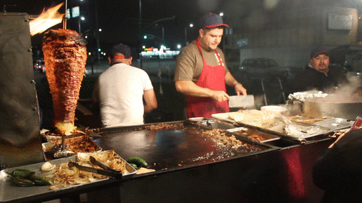

# TaqAPI 🌮

<br>

_This was created during my time as a student at [Code Chrysalis](https://www.codechrysalis.io/)._

A GraphQL/Apollo-powered API for querying taquerías.

<br>

<br>

```
A taco stand or taquería is a food stall, food cart or restaurant

that specializes in tacos and other Mexican dishes.

The food is typically prepared quickly and tends to be inexpensive.

Many various ingredients may be used, and various taco styles may be served.

Taco stands are an integral part of Mexican street food. 🌮
```

<br>

### Good taquerías are difficult to come across—often only through word-of-mouth.

_No more._ taqAPI is a database/API where you can find the taco stand of your dreams. 🌜

<br>

# How to use

### Find your favorite 🧡 taquería.

```

{
  taqueria(name: "La Cubanita") {
    name
    specialty
    rating
  }
}

```

### Search by rating to find the firest 🔥 tacos in town.

```

{
  taqueriasByRating(rating:3) {
    name
    rating
    specialty
  }
}

```

### Or simply order all taquerias. 🤟🏽

```

{
  taquerias {
    name
    rating
    specialty
  }
}

```

## Development

```

yarn

```

```

yarn dev

```

## Production

```

yarn launch

```
